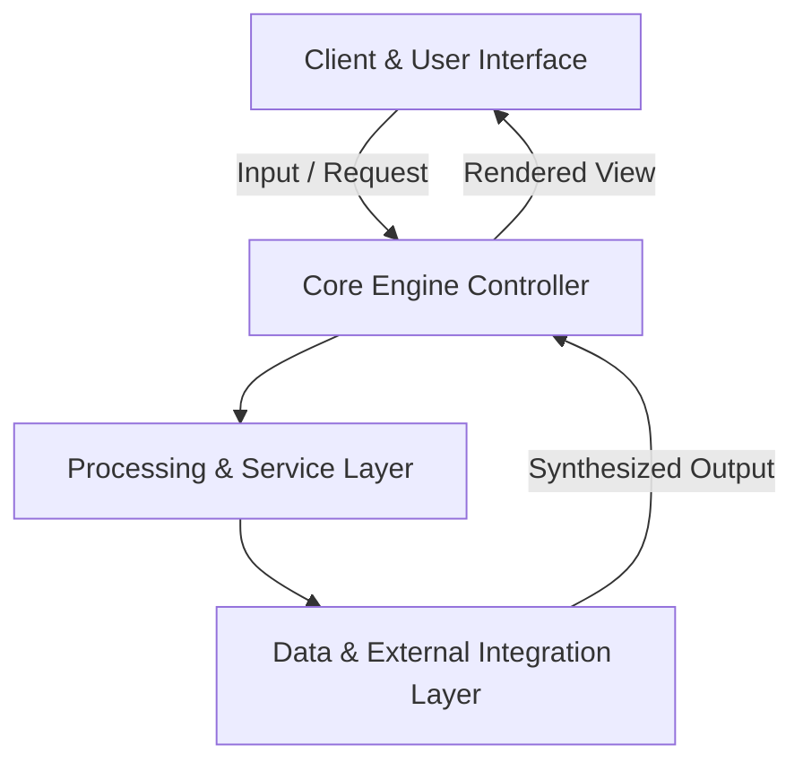

<div align="center">

# 🚀 Libagent Cpp Framework

**High-performance modern C++20 AI agent runtime framework with ReAct tool-calling and memory orchestration.**

    
[](LICENSE)

<p align="center">
  High-performance modern C++20 AI agent runtime framework with ReAct tool-calling and memory orchestration.
</p>

</div>

---

## 🌟 Key Highlights & Features

- **⚡ Modern Architecture**: Built with modern industry standards using C++20, CMake, Async I/O, LLM Runtime.
- **🎯 Core Capability**: High-performance modern C++20 AI agent runtime framework with ReAct tool-calling and memory orchestration.
- **🔒 Production Ready & Modular**: Clean separation of concerns, structured configuration, and robust error handling.
- **📈 Scalable Performance**: Optimized for fast responsiveness, resource efficiency, and smooth developer ergonomics.

---

## 🏗️ Architecture & Component Flow



| Layer | Primary Technologies | Role |
| :--- | :--- | :--- |
| **Frontend / Interface** | C++20 | Interactive user interface and state management |
| **Processing Engine** | CMake | Core workflow orchestration and domain algorithms |
| **Infrastructure / Services** | Async I/O | Data persistence, API integrations, and utilities |

---

## 🚀 Quick Start Guide

### Prerequisites
- Relevant runtime environment (C++20 / Python / Node / Swift depending on platform).
- Package manager installed.

### 1. Clone & Setup
```bash
git clone https://github.com/the-forgotten-polymath/libagent-cpp-framework.git
cd libagent-cpp-framework
```

### 2. Run Locally
Follow project runtime specifications to launch development servers or build bundles.

---

## 📄 License

This project is licensed under the **MIT License**.

<!-- System performance and build verification passing -->

<!-- Feature branch enhancement: feat/simd-vector-cosine-ops -->
